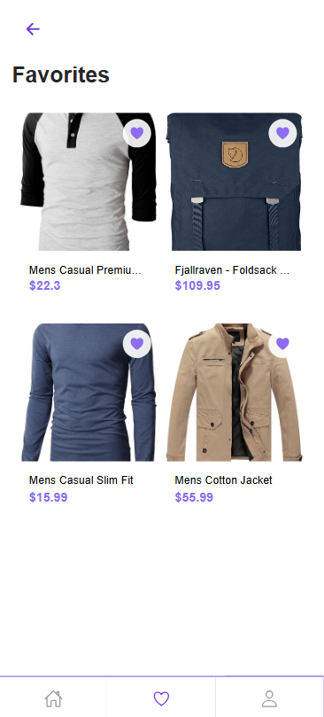

# E-commerce Mobile Application

## Built with Ionic & Angular 🛍️

Modern, full-featured e-commerce mobile application built with Ionic and Angular, featuring both customer shopping experience and admin management capabilities.

## 🎯 Key Features

- **Customer Features**

- **Product Discovery**

  - Browse products by category
  - Search functionality
  - Detailed product views
  - Image galleries

- **Shopping Experience**

  - Shopping cart management
  - Favorites/Wishlist
  - Quantity controls
  - Price calculations

- **User Features**
  - User authentication
  - Profile management
  - Saved favorites

### Admin Features

- **Product Management**

  - Add new products
  - Edit existing products
  - Delete products
  - Image management

- **Category Management**
  - Category organization
  - Product categorization
  - Category-based filtering

## 💻 Tech Stack

- **Frontend**

  - Ionic 7.x
  - Angular 19.x
  - TypeScript 5.x
  - SCSS
  - RxJS

- **Backend**
  - Node.js
  - Express
  - MongoDB
  - RESTful API

## 📱 Screenshots

**signup page**


**signin page**


**home page**


**product page**


**categories page**


**category list page**


**cart page**


**Favorites**



**Profile page**


**admin dashboard**


**Add product page**


**Edit product page**


## ⚙️ Installation

### Prerequisites

- Node.js (v18.x or higher)
- npm (v9.x or higher)
- Ionic CLI (`npm install -g @ionic/cli`)
- Angular CLI (`npm install -g @angular/cli`)

### Installation

1. **Clone the Repository**

```bash
# Clone repository
git clone https://github.com/yourusername/mf-ecommerce-app.git

# Install dependencies from package.json frontend
cd mf-ecommerce-app
npm install

# Install dependencies from package.json backend
cd backend
npm install

# start backend server
cd backend
npm start dev

# start frontend server
cd mf-ecommerce-app
ionic serve

# Build for production
ionic build --prod
```

## 🗂️ Project Structure

```
mf-ecommerce-app/
├── backend/
│   ├── .env
│   ├── package-lock.json
│   ├── package.json
│   └── src/
│     ├─ models/
│     │  ├─ cart.model.js
│     │  ├─ product.model.js
│     │  └─ user.model.js
│     ├─ routes/
│     │  ├─ auth.routes.js
│     │  ├─ cart.routes.js
│     │  ├─ category.routes.js
│     │  └─ product.routes.js
│     └─ server.js
├─ package.json
├─ src/
│  ├─ app/
│  │  ├─ app.component.html
│  │  ├─ app.component.scss
│  │  ├─ app.component.spec.ts
│  │  ├─ app.component.ts
│  │  ├─ app.routes.ts
│  │  ├─ guards/
│  │  │  └─ admin.guard.ts
│  │  ├─ models/
│  │  │  ├─ cartItem.model.ts
│  │  │  ├─ product.model.ts
│  │  │  └─ user.model.ts
│  │  ├─ pages/
│  │  │  ├─ admin/
│  │  │  │  ├─ add-product/
│  │  │  │  │  ├─ add-product.page.html
│  │  │  │  │  ├─ add-product.page.scss
│  │  │  │  │  └─ add-product.page.ts
│  │  │  │  ├─ admin-dashboard.page.html
│  │  │  │  ├─ admin-dashboard.page.scss
│  │  │  │  ├─ admin-dashboard.page.ts
│  │  │  │  └─ edit-product/
│  │  │  │     ├─ edit-product.page.html
│  │  │  │     ├─ edit-product.page.scss
│  │  │  │     └─ edit-product.page.ts
│  │  │  ├─ cart/
│  │  │  │  ├─ cart.page.html
│  │  │  │  ├─ cart.page.scss
│  │  │  │  └─ cart.page.ts
│  │  │  ├─ categories/
│  │  │  │  ├─ categories.page.html
│  │  │  │  ├─ categories.page.scss
│  │  │  │  ├─ categories.page.spec.ts
│  │  │  │  ├─ categories.page.ts
│  │  │  │  └─ category-list/
│  │  │  │     ├─ category-list.page.html
│  │  │  │     ├─ category-list.page.scss
│  │  │  │     ├─ category-list.page.spec.ts
│  │  │  │     └─ category-list.page.ts
│  │  │  ├─ favorites/
│  │  │  │  ├─ favorites.page.html
│  │  │  │  ├─ favorites.page.scss
│  │  │  │  └─ favorites.page.ts
│  │  │  ├─ home/
│  │  │  │  ├─ home.page.html
│  │  │  │  ├─ home.page.scss
│  │  │  │  ├─ home.page.spec.ts
│  │  │  │  └─ home.page.ts
│  │  │  ├─ product-details/
│  │  │  │  ├─ product-details.page.html
│  │  │  │  ├─ product-details.page.scss
│  │  │  │  ├─ product-details.page.spec.ts
│  │  │  │  └─ product-details.page.ts
│  │  │  ├─ profile/
│  │  │  │  ├─ profile.page.html
│  │  │  │  ├─ profile.page.scss
│  │  │  │  └─ profile.page.ts
│  │  │  ├─ sign-in/
│  │  │  │  ├─ sign-in.page.html
│  │  │  │  ├─ sign-in.page.scss
│  │  │  │  ├─ sign-in.page.spec.ts
│  │  │  │  └─ sign-in.page.ts
│  │  │  ├─ sign-out/
│  │  │  ├─ sign-up/
│  │  │  │  ├─ sign-up.page.html
│  │  │  │  ├─ sign-up.page.scss
│  │  │  │  ├─ sign-up.page.spec.ts
│  │  │  │  └─ sign-up.page.ts
│  │  │  └─ tabs/
│  │  │     ├─ tabs.page.html
│  │  │     ├─ tabs.page.scss
│  │  │     ├─ tabs.page.spec.ts
│  │  │     └─ tabs.page.ts
│  │  └─ services/
│  │     ├─ admin/
│  │     │  └─ admin.service.ts
│  │     ├─ auth/
│  │     │  ├─ auth.service.spec.ts
│  │     │  └─ auth.service.ts
│  │     ├─ cart/
│  │     │  ├─ cart.service.spec.ts
│  │     │  └─ cart.service.ts
│  │     ├─ categories/
│  │     │  ├─ categories.service.spec.ts
│  │     │  └─ categories.service.ts
│  │     ├─ favorites/
│  │     │  ├─ favorites.service.spec.ts
│  │     │  └─ favorites.service.ts
│  │     └─ product/
│  │        ├─ product.service.spec.ts
│  │        └─ product.service.ts
│  ├─ assets/
│  │  ├─ i18n/
│  │  │  ├─ ar.json
│  │  │  └─ en.json
│  │  ├─ icon/
│  │  │  ├─ apple-icon.svg
│  │  │  ├─ facebook-icon.svg
│  │  │  ├─ favicon.png
│  │  │  ├─ google-icon.svg
│  │  │  └─ order-icon.svg
│  │  ├─ images/
│  │  │  └─ avatar.svg
│  │  └─ shapes.svg
│  ├─ environments/
│  │  ├─ environment.prod.ts
│  │  └─ environment.ts
│  ├─ package-lock.json
│  ├─ package.json
│  ├─ tsconfig.json
│  ├─ tsconfig.app.json
│  ├─ tsconfig.spec.json
│  └─ tsconfig.app.json

```

## 🚀 API Documentation

### Auth API

- POST `/api/auth/signup` - Sign up a new user
- POST `/api/auth/signin` - Sign in a user

### Products API

- GET `/api/products` - Get all products
- POST `/api/products` - Create new product
- PUT `/api/products/:id` - Update product
- DELETE `/api/products/:id` - Delete product

### Categories API

- GET `/api/categories` - Get all categories
- GET `/api/categories/:id/products` - Get products by category

## 💡 Implementation Highlights

- **State Management**

  - Using Angular Signals for reactive state
  - Centralized services for data management

- Persistent storage for cart and favorites using local storage and capacitor preferences

### Performance Optimizations

- Lazy loading of modules

## 🔒 Security Features

- Protected admin routes
- Input validation
- CORS configuration

## 🌐 Browser Support

- Chrome (latest)
- Firefox (latest)
- Safari (latest)
- Edge (latest)

## 📱 Mobile Platform Support

- iOS 13+
- Android 8+
- PWA support

## 🤝 Contributing

1. Fork the repository
2. Create your feature branch (`git checkout -b feature/AmazingFeature`)
3. Commit changes (`git commit -m 'Add AmazingFeature'`)
4. Push to branch (`git push origin feature/AmazingFeature`)
5. Open a Pull Request

## 👨‍💻 Author

**Mohamed Ibrahim**

- GitHub: [@YourGitHub](https://github.com/MohamedSallam1234)
- LinkedIn: [Your LinkedIn](https://www.linkedin.com/in/mohamed-sallam-775b901a1/)

> If you found this project interesting or helpful, please consider giving it a ⭐
